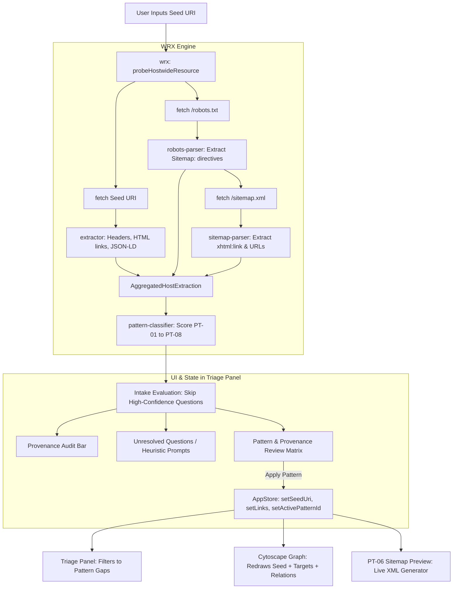

# Prestage Questionnaires, Semi-Automatic Pattern Deduction & Provenance Engine

- **Author**: Antigravity & Pair Programming Partner
- **Date**: 2026-09-28
- **Status**: Approved Design Spec
- **Target Component**: `webmap-ER` (`src/core/wrx/`, `src/core/triage/`, `src/core/state/`, `src/ui/components/`)

---

## 1. Executive Summary & Problem Statement

In `webmap-ER`, users diagnose web resources to achieve conformance with Radical Transparency (RT) and signposting specifications ([RFC 8288](https://datatracker.ietf.org/doc/html/rfc8288), [RFC 9264](https://datatracker.ietf.org/doc/html/rfc9264), and the EOSC Semantic Interoperability RT Patterns [PT-01 to PT-08](file:///c:/Users/cedricd/Documents/Github/webmap-ER/src/core/rt/patterns.ts#L13-L102)).

Previously, diagnosis was confined to single-URI inspection of HTTP `Link` headers and embedded HTML `<link>` tags. This created multiple pain points:
1. Users had to manually guess which of the 8 RT patterns to evaluate unless an API or link relation was already explicitly present.
2. Hostwide discovery assets—specifically `robots.txt` and `sitemap.xml` (which are central to [PT-06](file:///c:/Users/cedricd/Documents/Github/webmap-ER/src/core/rt/patterns.ts#L70-L79))—were not automatically probed by the Web Resource eXtraction (`wrx`) engine.
3. Users had to step through boilerplate triage questions even when the underlying server configuration or metadata already definitively answered them.
4. There was no persistent provenance recording showing *how* each relation was determined (e.g. machine-extracted from `robots.txt` vs. guessed by heuristics vs. filled by a human).

This feature introduces an integrated **Intake & Pattern Deduction Subsystem** embedded directly within the left triage panel. The subsystem uses enhanced `wrx` components to probe the seed resource, `/robots.txt`, and XML sitemaps, deduces the most appropriate Radical Transparency pattern with confidence ratings, automatically skips high-confidence questions, provides a persistent provenance audit trail, and automatically synchronizes the clinical triage questions and Cytoscape graph view when a pattern is adopted.

---

## 2. Core Goals & Non-Goals

### Goals
- **Automated Hostwide Discovery in `wrx`**: Probe `/robots.txt` for `Sitemap:` directives and XML sitemaps for `<xhtml:link>` signposting relations and resource URL distributions.
- **Pattern Classification & Confidence Engine**: Deduce the best-fitting pattern among PT-01 through PT-08 with explicit confidence ratings (`high`, `medium`, `low`).
- **Two-Tier Prestage Questions with Auto-Skip**:
  - *Tier 1*: Resource Archetype classification (e.g. Catalog vs. Dataset vs. API vs. Composite Profile).
  - *Tier 2*: Key pattern-specific signposting endpoints.
  - Automatically skip questions that are answered with high confidence by explicit machine evidence.
  - Pre-select best-guess options for heuristic inferences.
- **Persistent Provenance & In-Panel Review Matrix**:
  - Embedded inside the left triage panel (no distracting modal popups).
  - Records the origin of every relation (`AUTO_ROBOTS`, `AUTO_SITEMAP`, `AUTO_LINK_HEADER`, `AUTO_JSONLD`, `HUMAN`).
  - Allows users to review all answers, inspect the crawler audit trail, step backward/undo, and override values at any time.
- **Automatic UI & Graph Synchronization**: Updating the pattern automatically switches the active pattern filter in the triage questionnaire and updates the Cytoscape topology graph in real time.

### Non-Goals
- Performing deep recursive web crawling across thousands of URLs in a sitemap. `wrx` samples the first 50 entries and detects signposting tags.
- Bypassing browser-enforced CORS restrictions on arbitrary third-party servers. `wrx` implements clean heuristic fallbacks when CORS prevents direct fetching.

---

## 3. Subsystem Architecture & Data Flow



---

## 4. Detailed Component Specifications

### 4.1. `src/core/wrx/robots-parser.ts`
Responsible for parsing `/robots.txt` contents.
- **Functions**:
  - `parseRobotsTxt(content: string, baseUrl: string): RobotsTxtResult`
- **Extracted Data**:
  - `sitemaps: string[]`: Fully resolved URLs of all `Sitemap:` directives.
  - `disallowedPaths: string[]`: Paths barred to crawlers.
  - `hasApiDisallows: boolean`: True if paths like `/api` or `/private` are present.
  - `hasCatalogPaths: boolean`: True if paths like `/catalog`, `/dataset`, or `/records` are present.

### 4.2. `src/core/wrx/sitemap-parser.ts`
Responsible for parsing XML sitemaps using the browser's `DOMParser`.
- **Functions**:
  - `parseSitemapXml(xmlContent: string, sitemapUrl: string): SitemapParseResult`
- **Extracted Data**:
  - `isSitemapIndex: boolean`: True if root tag is `<sitemapindex>`.
  - `childSitemaps: string[]`: URLs inside `<sitemap><loc>`.
  - `urls: string[]`: Sampled resource URLs (up to 50 items).
  - `signpostingLinks: DiscoveredLink[]`: Extracted `<xhtml:link rel="..." href="...">` tags associated with individual `<url>` entries.
  - `detectedRelations: string[]`: Unique relation types discovered (e.g. `item`, `describedby`, `profile`).

### 4.3. `src/core/wrx/host-prober.ts`
High-level discovery coordinator within `wrx`.
- **Functions**:
  - `probeHostwideResource(seedUrl: string, fetchFn?: typeof fetch): Promise<AggregatedHostExtraction>`
- **Workflow**:
  1. Concurrently issues requests for:
     - The target seed URL (via `extractResourceLinks(seedUrl, fetchFn)`).
     - The host's `/robots.txt` (derived from seed URL origin).
  2. If `robots.txt` reveals `Sitemap:` directives, probes the first sitemap. If none is listed in `robots.txt`, attempts fallback to `${origin}/sitemap.xml`.
  3. Aggregates all links, content types, traces, and parsing results into `AggregatedHostExtraction`.
  4. Records detailed trace items indicating success or CORS restrictions for each probe.

### 4.4. `src/core/wrx/pattern-classifier.ts`
Evaluates `AggregatedHostExtraction` to classify resource archetype and compute pattern confidence for PT-01 through PT-08.
- **Scoring Rules**:
  - **[PT-06 Hostwide Discovery]**:
    - `high` (85-100%): Sitemap contains `<xhtml:link rel="...">` signposting or `robots.txt` points to signposted sitemaps.
    - `medium` (50-80%): Sitemap exists at root with dataset/record URL patterns, but lacks signposting links.
  - **[PT-05 Subsetting API]**:
    - `high` (85-100%): `rel="service-desc"` present or OpenAPI/Swagger JSON detected at seed or linked URL.
    - `medium` (50-80%): Seed URL path matches `/api/`, `/v1/`, or HTML mentions OpenAPI/Swagger.
  - **[PT-07 Catalog Assistance]**:
    - `high` (85-100%): `rel="item"` or `rel="collection"` present in link headers or RDF.
    - `medium` (50-80%): Seed URL path matches `/catalog` or `/collections`.
  - **[PT-01 Profile Conformity]**:
    - `high` (85-100%): Embedded JSON-LD has `conformsTo` or `@context` matching RO-Crate, DCAT-AP, DwC.
    - `medium` (50-80%): Direct RDF/JSON-LD present without specialized API or catalog wrapper.
  - **[PT-04 Direct Metadata / No Landing Page]**:
    - `high` (85-100%): `rel="describedby"` and `rel="cite-as"` (DOI) present directly.
- **Output**:
  - `recommendedPattern: string` (`PT-01` to `PT-08`)
  - `confidence: 'high' | 'medium' | 'low'`
  - `scorePercent: number` (0 - 100)
  - `rationale: string`
  - `detectedSignals: string[]`

### 4.5. `src/core/triage/intake-model.ts`
Manages the two-tier question items and resolution states:
- **Resolution Sources**:
  - `AUTO_ROBOTS`: Extracted directly from `robots.txt`.
  - `AUTO_SITEMAP`: Extracted from XML sitemap parsing.
  - `AUTO_LINK_HEADER`: Extracted from HTTP `Link` header.
  - `AUTO_JSONLD`: Extracted from embedded JSON-LD or RDF body.
  - `AUTO_HEURISTIC`: Inferred from URL pattern or HTML meta.
  - `HUMAN`: Entered or confirmed by the user.
  - `UNRESOLVED`: Not yet resolved.
- **Auto-Skip Logic**:
  - Any question where `source` is one of `AUTO_ROBOTS`, `AUTO_SITEMAP`, `AUTO_LINK_HEADER`, or `AUTO_JSONLD` and `confidence === 'high'` is flagged as `skipped = true`.
  - Questions with `AUTO_HEURISTIC` are marked with `skipped = false`, and their pre-selected value is set to the heuristic guess.

### 4.6. `src/core/state/store.ts` Updates
The `AppState` is updated to record persistent relation provenance:
```typescript
export interface PrescribedRelationProvenance {
  rel: string;
  targetUri: string;
  source: 'AUTO_ROBOTS' | 'AUTO_SITEMAP' | 'AUTO_LINK_HEADER' | 'AUTO_JSONLD' | 'AUTO_HEURISTIC' | 'HUMAN';
  evidence?: string;
  timestamp: number;
}

export interface AppState {
  // Existing fields...
  activePatternId: string;
  links: DiscoveredLink[];
  // New Provenance & Intake fields:
  provenanceHistory: PrescribedRelationProvenance[];
  intakeSummary?: {
    recommendedPatternId: string;
    confidence: 'high' | 'medium' | 'low';
    scorePercent: number;
    rationale: string;
    skippedQuestionCount: number;
    totalQuestionCount: number;
    crawlAudit: Array<{ target: string; status: 'SUCCESS' | 'CORS_RESTRICTED' | 'NOT_FOUND'; message: string }>;
  };
}
```

### 4.7. `src/ui/components/triage-panel.ts` UI Workflow
The left triage panel houses the complete flow:
1. **Target Seed Input**:
   - User types URI and clicks **Diagnose (wrx)**.
2. **Provenance & Intake Audit Bar**:
   - Rendered right below the seed input.
   - Shows live crawl badges: `robots.txt (✓)`, `sitemap.xml (✓)`, `seed headers (✓)`.
   - Shows recommended pattern: `Deduced: PT-06 Hostwide Discovery (92% Conf)`.
   - Displays a button: `[View Provenance & Review Matrix]`.
3. **Questionnaire Area**:
   - If there are unresolved or heuristic questions, displays them sequentially with step indicator (e.g. `Question 1 of 2 (2 Auto-Skipped)`).
   - "Previous" and "Undo" buttons allow stepping back.
4. **Pattern & Provenance Review Matrix Card**:
   - Can be toggled or reached at the end of the question sequence.
   - Displays a clean table of all candidate relations for the pattern.
   - Each row displays:
     - Relation / Target specification
     - Current value / URI
     - Provenance tag with color: `[AUTO: robots.txt]` (green), `[AUTO: JSON-LD]` (green), `[AUTO: Heuristic]` (amber), `[HUMAN]` (blue).
     - Inline "Edit" button to change a value.
   - Includes a **"Pattern Selector"** button group allowing manual override if the user prefers another pattern.
   - Primary Action: **"Apply Pattern & Synchronize Workspace"**:
     - Sets active pattern filter.
     - Commits links and provenance.
     - Re-renders triage gaps andCytoscape graph view.

---

## 5. Error Handling & CORS Fallback Strategy

| Scenario | System Reaction | User Experience |
|----------|-----------------|-----------------|
| Third-party server blocks `/robots.txt` or `/sitemap.xml` via CORS | Caught in `host-prober.ts`. Logged as `CORS_RESTRICTED` in crawl audit. | Badge shows `[CORS Restricted: Heuristic Mode Active]`. No silent skips; questions are presented with heuristic defaults pre-selected. |
| Server returns 404 for `robots.txt` and `sitemap.xml` | Caught in `host-prober.ts`. Logged as `NOT_FOUND`. | Pattern classifier lowers PT-06 score and evaluates seed resource for PT-01, PT-04, PT-05. |
| Malformed XML in `sitemap.xml` | `DOMParser` detects `parsererror`. | Error caught safely; valid `<xhtml:link>` elements parsed before error are preserved, and fallback heuristics apply. |
| Malformed or incomplete seed URI | Safe URL normalization catches errors with helpful toast. | User alerted: `Invalid URL format. Please include protocol (e.g., https://)`. |

---

## 6. Verification & Test Suite

The test suite will be implemented using Vitest in `tests/`:

1. **`tests/wrx-robots.test.ts`**:
   - Verifies extraction of single and multiple `Sitemap:` directives.
   - Verifies handling of relative paths, query strings, and comment stripping.
2. **`tests/wrx-sitemap.test.ts`**:
   - Verifies parsing of standard `<urlset>`, `<sitemapindex>`, and embedded `<xhtml:link rel="item" href="...">` elements.
   - Verifies syntax error handling on invalid XML bodies.
3. **`tests/wrx-host-prober.test.ts`**:
   - Tests `probeHostwideResource()` with mocked `fetchFn` covering 200 OK, 404 Not Found, and CORS Network Error scenarios.
4. **`tests/pattern-classifier.test.ts`**:
   - Verifies pattern scoring and rationale generation across PT-01 through PT-08 test fixtures.
5. **`tests/intake-model.test.ts`**:
   - Verifies that high-confidence questions are skipped, heuristic questions are pre-filled, and resolution provenance is correctly logged.
6. **`tests/triage-panel-intake.test.ts`**:
   - Tests panel rendering of the provenance audit bar, stepping through remaining questions, toggling the Review Matrix, and confirming that applying a pattern updates the store and graph.
